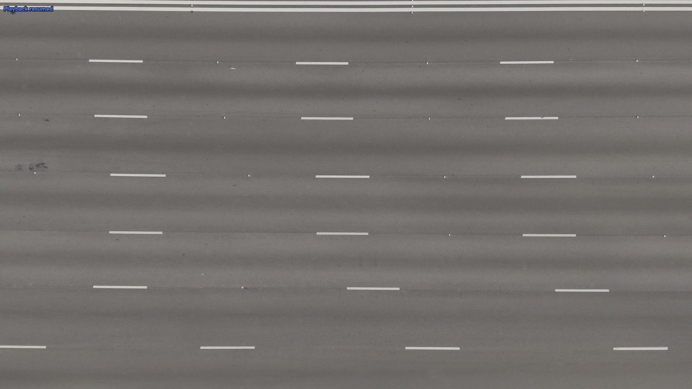
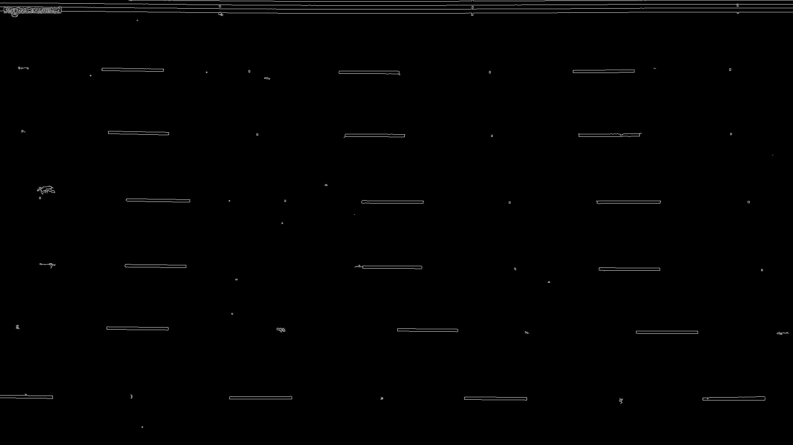
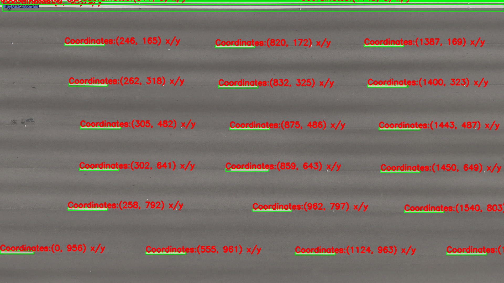
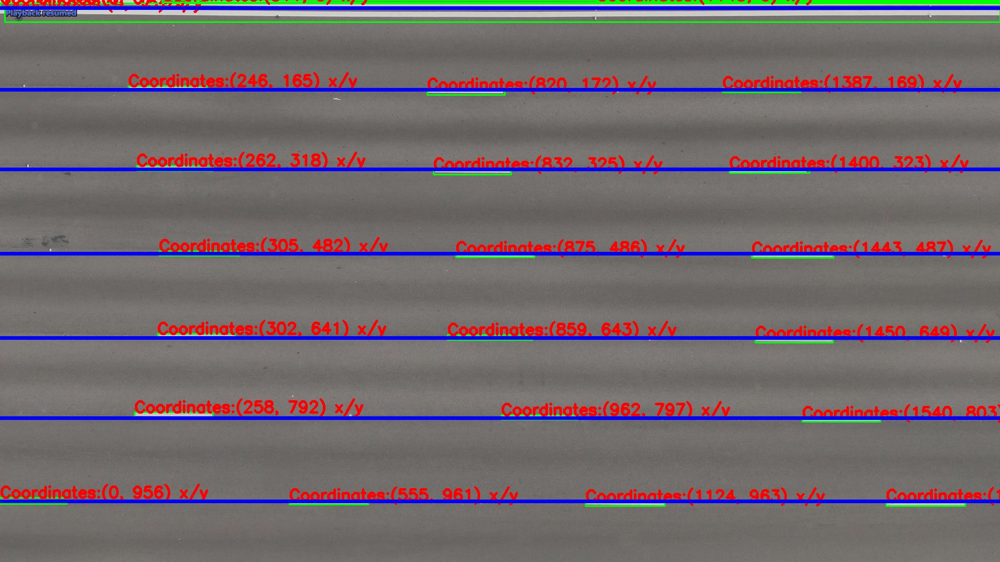

# speedvision

Real-time vehicle speed detection from highway camera footage using OpenCV.

`speedvision` processes a highway video, automatically detects lane boundaries, splits the feed by lane, tracks vehicles across detection lines, and calculates their speed in km/h. Vehicles exceeding the speed limit are flagged and their images saved.

## Input / Output

**Input: reference frame used for lane detection**



**Lane boundary detection (greyscale + Canny edges)**



**Output: annotated frame with vehicle detection and speed overlay**

| Detection output | Alt view |
|---|---|
|  |  |

**Sample per-lane split clips** (pre-run, from `assets/samples/`):

| Lane 1 | Lane 2 | Lane 3 |
|--------|--------|--------|
|  |  |  |

| Lane 4 | Lane 5 | Lane 6 |
|--------|--------|--------|
|  |  |  |

---

## How It Works

1. **Lane detection** — uses Canny edge detection and contour analysis on a reference image to find lane boundaries
2. **Video splitting** — splits the input video into per-lane video streams
3. **Speed calculation** — tracks vehicle centroids across two detection lines, computes km/h using pixel-to-km calibration and frame timing
4. **Flagging** — saves snapshots of vehicles exceeding the speed limit

## Tech Stack

- **Language:** Python 3
- **Vision:** OpenCV (`cv2`)
- **Parallelism:** Python `threading` (one thread per lane)

## Project Structure

```
speedvision/
├── src/
│   └── speed_detect.py     # Full pipeline: lane detection, splitting, speed calc
├── assets/
│   ├── input-image.jpg     # Reference frame for lane detection
│   ├── input.mp4           # Sample input highway video
│   ├── gray.jpeg           # Greyscale reference output
│   ├── output.jpeg         # Sample detection output
│   ├── output1.jpeg        # Sample detection output (alt)
│   └── samples/            # Pre-run per-lane split clips
│       ├── output1.avi
│       ├── output2.avi
│       ├── output3.avi
│       ├── output4.avi
│       ├── output5.avi
│       └── output6.avi
├── requirements.txt
└── LICENSE
```

## Setup

```bash
pip install -r requirements.txt
```

## Usage

```bash
python src/speed_detect.py \
  --input-image assets/input-image.jpg \
  --input-video assets/input.mp4 \
  --output-dir output \
  --speed-limit 100
```

### All options

| Flag | Default | Description |
|------|---------|-------------|
| `--input-image` | `assets/input-image.jpg` | Reference frame for lane detection |
| `--input-video` | `assets/input.mp4` | Highway video to process |
| `--output-dir` | `output` | Directory for split/final videos and images |
| `--speed-limit` | `100` | Speed limit in km/h; faster vehicles are flagged |
| `--start-line` | `100` | Start detection line x-coordinate |
| `--stop-line` | `400` | Stop detection line x-coordinate |

## Output Structure

```
output/
├── split/
│   ├── output1.avi         # Per-lane split video
│   └── output2.avi
└── final/
    ├── output1.avi         # Annotated output with speed overlay
    └── image/
        ├── 1/              # All vehicle snapshots for lane 1
        └── overspeed/      # Snapshots of vehicles over the limit
```

## Calibration

The default `km_per_pix = 0.0035 / lane_height` ratio is calibrated for standard highway footage. Adjust this constant in `src/speed_detect.py` for different camera heights or zoom levels.

## License

[MIT](LICENSE)
